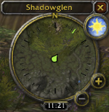
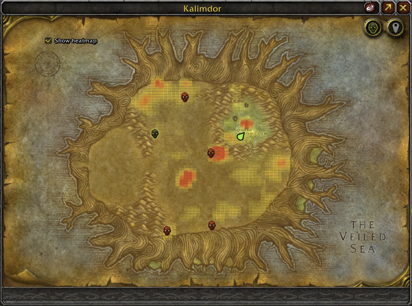
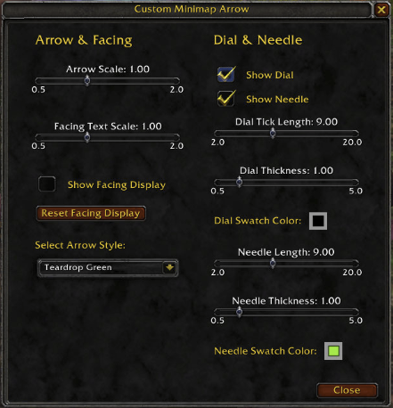

# Custom Minimap Arrow Addon for World of Warcraft

## Overview
Take full control of your minimap arrow! Stylish designs, custom vector dial & needle with adjustable ticks, thickness & colors. Always renders on top. Smart dungeon & Rotate Minimap support. World Map support. Works on Retail & all Classic versions.

## Features
- Always-On-Top Arrow Rendering – High-priority overlay layering and frame depth ensure your custom minimap arrow always appears above other minimap elements and addons.
- Smart Dungeon & Rotate Minimap Support – Automatically adapts to the “Rotate Minimap” setting. In dungeons the arrow stays correctly oriented and scaled; outdoors it falls back to the engine’s native behavior when needed.
- Fully Customizable Vector Dial & Needle – Programmatically drawn 36-tick dial (major ticks every 30°) and a dynamic rotating needle that tracks your heading in real time. Both scale and move with the minimap and can be shown or hidden independently.
- Precise Scale Controls – Independently adjust the size of the minimap arrow and the facing-text display.
- Custom Arrow Styles – Replace the default minimap arrow with a selection of clean, modern designs.
- Facing Display – Movable compass-style frame that shows your exact facing direction in degrees, with its own scale and reset option.
- World Map Support - Added a custom `WorldMapArrowFrame` that renders above all other UI elements. Automatically hides the default Blizzard player arrow. Robust handling for dungeons/instances and full cross-version compatibility (Classic through Retail).  
- Respects Arrow Scale setting and player facing.
- Configuration Panel – Open with /cma. Intuitive layout gives you direct control over arrow style, facing text, dial/needle visibility, tick length & thickness, needle length & thickness, and live color swatches (with clear borders for dark colors). Supports both modern and classic color pickers.

## Installation
1. Download the addon.
2. Unzip and copy `CustomMinimapArrow` folder into the World of Warcraft `Interface\AddOns` folder.
3. Restart World of Warcraft or reload your UI.

## Usage
- Type `/cma` to open the expanded settings panel.
- Adjust Arrow Scale and Facing Text Scale with the sliders.
- Select an arrow style from the dropdown.
- Toggle the Facing Display on/off and drag it anywhere on screen; use the Reset Facing button to return it to default.
- Independently show or hide the Dial and Needle overlays.
- Fine-tune Dial Tick Length, Dial Thickness, Needle Length, and Needle Thickness.
- Click the color swatches to pick any color for the dial or needle (live preview included).

## Community

If you need help or have questions about this application, the best way to get support is by joining the Discord.

To join the Discord, click on this invite link: [Discord](https://discord.com/invite/aP9CjWE)

### Donations

If you enjoy using this project and find it helpful, please consider supporting its development. Your support helps to ensure the project's continued development, bug fixes, and improvements.

If you would like to make a financial contribution to support development, you can donate using the following method:

- [Ko-fi](https://ko-fi.com/NiceShyGuy)

Your donation, no matter the size, is greatly appreciated and will help to support future development and maintenance. Thank you for your generosity!

### Other Ways to Support

- Share this project.
- Report any issues you encounter or suggest new features and improvements by creating a new issue on the GitHub repository.
- Contribute to the project by submitting pull requests with bug fixes, new features, or improvements to the code or documentation.
- Star the repository on GitHub to show your appreciation for the project.